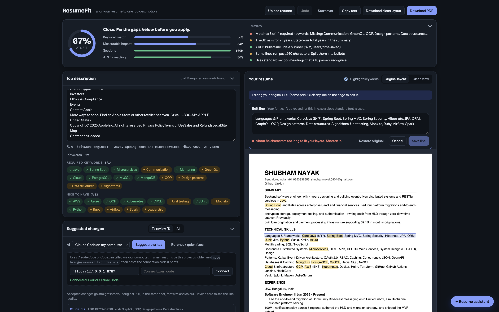
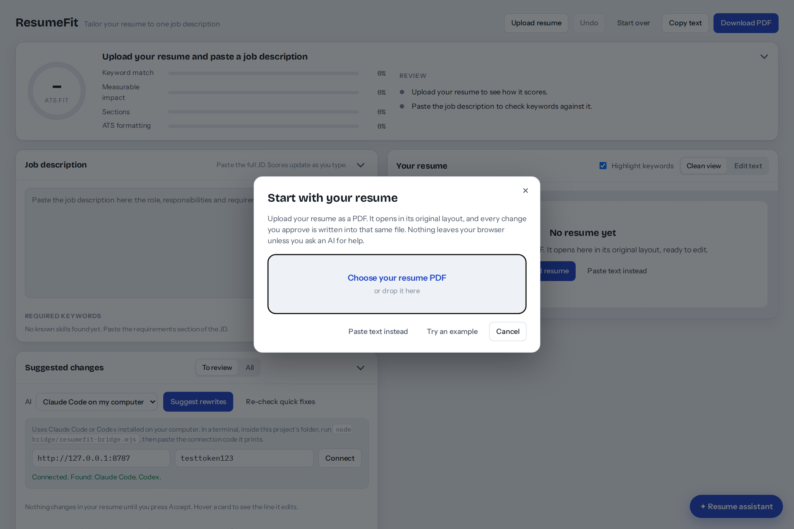
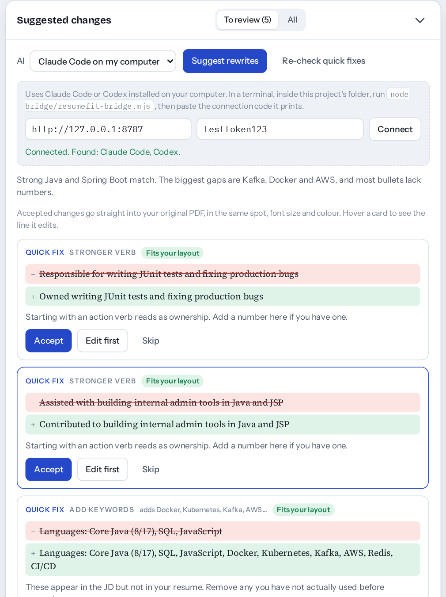
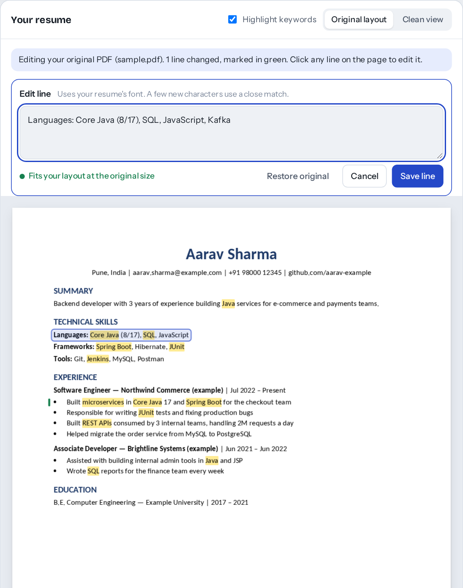
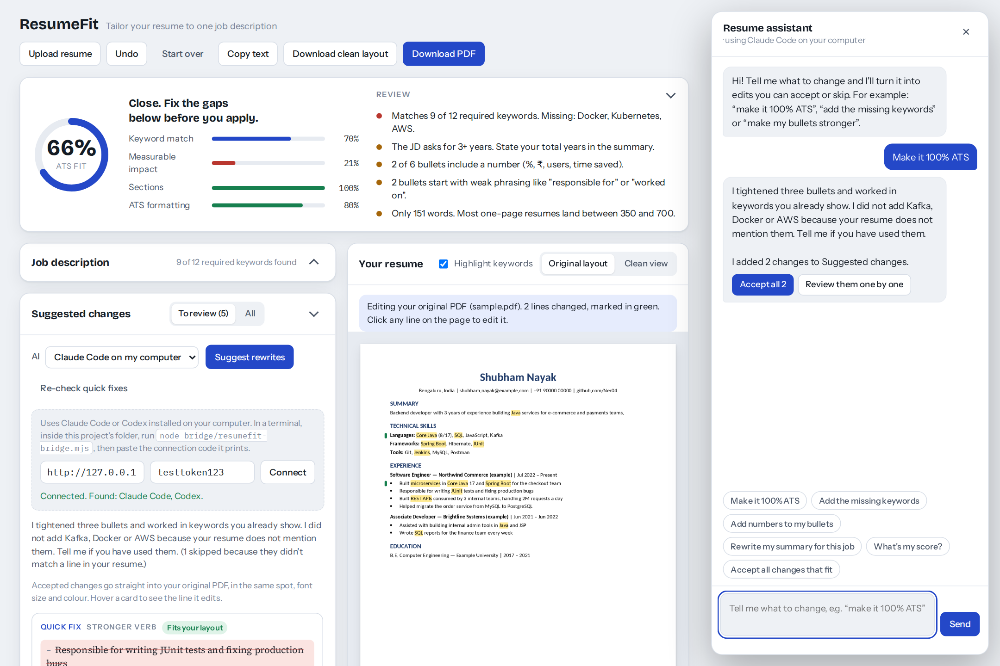
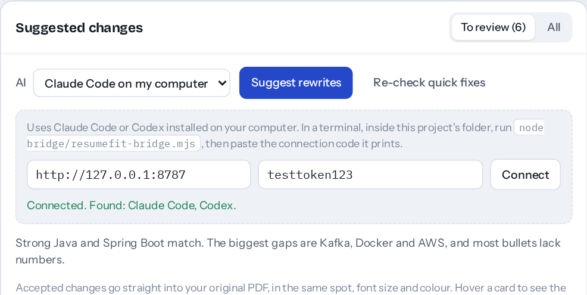
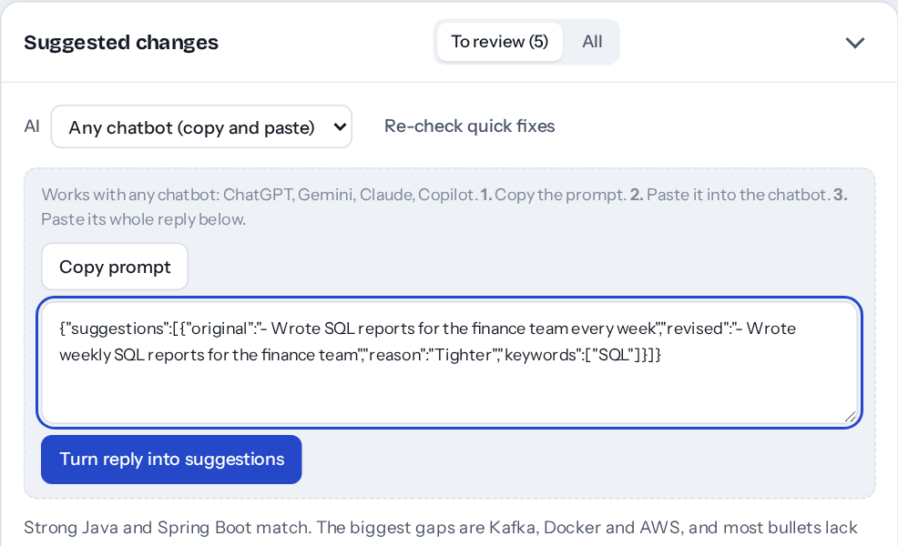

# resume-editor-

**ResumeFit** tailors your resume to one job description. Paste the job description, upload your resume PDF, and you get:

- **An ATS fit score** as soon as both are loaded, so you know whether a resume is worth tailoring before you spend time on it.
- **Keyword matching**: every skill in the job description, marked found or missing, including versions like `Core Java (8/17)`, `Java 1.8`, `Spring Boot 3` or `Angular 15+`.
- **Suggested changes you approve one by one**: nothing in your resume changes until you press **Accept**.
- **Edits inside your original PDF**: changed lines keep their position, font, size and colour. Everything else stays exactly as it was.
- **A resume assistant** you can give commands to, like "make it 100% ATS" or "add numbers to my bullets". It turns them into edits you can accept.

It runs entirely in your browser. There is no server, sign-up or database.



## Use it

**Online:** once GitHub Pages is turned on for this repo, open `https://ner04.github.io/resume-editor-/`.

**On your computer:** download or clone the repo and open `index.html` in your browser. To use Claude Code or Codex, start the local helper described below instead. It serves the app for you.

```bash
git clone https://github.com/Ner04/resume-editor-.git
cd resume-editor-
# open index.html, or:
node bridge/resumefit-bridge.mjs
```

## How to use it

1. When you open the app, a popup asks for your resume. Choose your PDF or drop it in. It appears on the right in its original layout. You can also paste text, try an example, or cancel and upload later.
2. Paste the job description on the left. The keyword list and score update as you type.
3. Review the **Suggested changes**. Each card shows the old line crossed out and the new line in green. Press **Accept**, **Edit first** or **Skip**.
4. Or open the **Resume assistant** (bottom right) and tell it what you want. Its edits land in Suggested changes, and **Accept all** applies every one that fits.
5. Click any line on the page to edit it yourself. Each edit shows whether the new text fits the space.
6. Click **Download PDF** to get your original PDF with only the changed lines replaced. **Download clean layout** gives you a plain single-column version instead.

Use the arrow on the score, Job description and Suggested changes panels to collapse them, so your resume and the part you're working on sit side by side. The resume stays in view while you scroll.

Only add skills you have actually used. Recruiters ask about everything on your resume.



| Review suggested changes | Edit any line in place |
| --- | --- |
|  |  |

## Resume assistant

Click **Resume assistant** at the bottom right and type what you want, or tap a suggestion:

- "Make it 100% ATS"
- "Add the missing keywords"
- "Add numbers to my bullets"
- "Rewrite my summary for this job"

The assistant uses whichever AI is picked in the **AI** menu. Its edits appear as cards in Suggested changes. You can review them one by one, or press **Accept all** to apply every edit that fits your layout. They count as a single step, so one **Undo** reverts them all.

It is honest about limits: no resume can guarantee a 100% ATS pass. It won't add skills your resume doesn't show. It asks you to confirm them first.

A few commands work without any AI: "What's my score?", "Which keywords are missing?", "Accept all changes that fit" and "Undo".

With the copy-and-paste option, the assistant gives you a request to copy into any chatbot. Paste the chatbot's reply back into the chat.



## AI suggestions: three ways

The scoring, keyword checks and quick fixes work without AI. For line-by-line rewrites, pick one option in the **AI** menu under Suggested changes.

| Option | What you need | Cost |
| --- | --- | --- |
| **Claude Code on my computer** | [Claude Code](https://docs.claude.com/en/docs/claude-code/overview) installed and signed in | Uses your own Claude plan |
| **Codex on my computer** | [Codex CLI](https://github.com/openai/codex) installed and signed in | Uses your own ChatGPT/OpenAI plan |
| **Any chatbot (copy and paste)** | Nothing: ChatGPT, Gemini, Claude or Copilot in any tab | Free |

When the page runs as a Claude artifact inside claude.ai, a fourth option, **Claude (in this page)**, appears automatically.

### Use Claude Code or Codex (the local helper)

A web page can't start programs on your computer by itself. `bridge/resumefit-bridge.mjs` is a small helper that connects the page to your installed CLI. It needs Node.js 18 or newer and has no other dependencies.

1. Install Claude Code or Codex, and run it once in a terminal so you're signed in.
2. In this project's folder, run:
   ```bash
   node bridge/resumefit-bridge.mjs
   ```
3. It prints a **connection code** and a link like `http://127.0.0.1:8787/#bridge=…`. Open that link and the app opens already connected.
   Using the GitHub Pages version instead? Choose **Claude Code on my computer** or **Codex on my computer**, paste the code, and press **Connect**.
4. Press **Suggest rewrites**. Keep the terminal window open while you use it.



**Safety:**
- The helper only listens on `127.0.0.1`, so other devices on your network can't reach it.
- Every request needs the connection code, so other websites you visit can't use it.
- Claude Code runs with its tools turned off, and Codex runs in its read-only sandbox. Both run in an empty temporary folder.
- Your resume goes only to the AI tool you picked. The helper stores nothing.

**Settings** (optional environment variables):

| Variable | Default | Purpose |
| --- | --- | --- |
| `RESUMEFIT_PORT` | `8787` | Port to listen on |
| `RESUMEFIT_TOKEN` | random | A fixed connection code, so you don't have to paste a new one each time |
| `RESUMEFIT_ORIGINS` | any | Only allow these sites, e.g. `https://ner04.github.io` |
| `RESUMEFIT_TIMEOUT` | `240` | Seconds to wait for an answer |
| `RESUMEFIT_CLAUDE_BIN` / `RESUMEFIT_CODEX_BIN` | `claude` / `codex` | Path to the CLI if it isn't on your PATH. The helper also checks common install folders (Homebrew, npm, nvm, `~/.local/bin`) and your shell's PATH |
| `RESUMEFIT_CLAUDE_ARGS` / `RESUMEFIT_CODEX_ARGS` | see the script | JSON array to replace the CLI arguments, if a future CLI version changes its flags |

**Codex or Claude Code shows "not found" but is installed?** Find its path with `which codex` (or `which claude`) in a normal terminal, then start the helper with it:
```bash
RESUMEFIT_CODEX_BIN="$(which codex)" node bridge/resumefit-bridge.mjs
```
The Codex desktop app and the Codex command-line tool are separate. The helper needs the command-line tool (`npm i -g @openai/codex` or `brew install codex`).

**Browser note:** Chrome and Edge let the GitHub Pages version talk to the helper. Safari and some Firefox setups block https pages from calling `http://127.0.0.1`. If **Connect** fails there, open the link the helper prints instead.

### Use any chatbot (copy and paste)

1. Choose **Any chatbot (copy and paste)** and press **Copy prompt**.
2. Paste it into ChatGPT, Gemini, Claude or any other chatbot.
3. Copy the chatbot's whole reply, paste it into the box, and press **Turn reply into suggestions**.

Extra text or code fences around the reply are fine. The app finds the suggestions inside.



## How the original-layout editing works

A PDF doesn't store paragraphs. It stores letters placed at exact positions. ResumeFit:

1. Reads every line's position, font, size and colour with [pdf.js](https://mozilla.github.io/pdf.js/).
2. When you change a line, removes only that line's old text from the PDF's content, so an ATS won't read the old and new wording together.
3. Writes the new text in the same place with [pdf-lib](https://pdf-lib.js.org/). It reuses the font embedded in your resume whenever that font has the letters it needs, and keeps mixed styles within a line, such as a bold `Languages:` label.

**Limits:**
- A changed line has to fit the space the old line used. Text can shrink to 85% of its size, but it can't push the lines below it down. The app tells you when a line is too long.
- New lines or sections can't be added without changing the layout. Use **Download clean layout** for that.
- Scanned (image-only) and password-protected PDFs can't be edited in place. You can still paste the text.
- A letter your resume never uses (a capital `K`, say) is drawn in the closest standard font.


## Scoring

The overall score is a guide, not a guarantee. Every company's ATS filters differently.

| Part | Weight | What it checks |
| --- | --- | --- |
| Keyword match | 55% | Job description skills found in your resume. Required skills count double compared with nice-to-have ones |
| Measurable impact | 20% | Bullets with numbers, and weak phrases like "responsible for" |
| Sections | 15% | Summary, experience, education, skills, email and phone |
| ATS formatting | 10% | Length, first-person wording, symbols that confuse parsers |

## Project structure

```
index.html                  page layout and styles
src/app.js                  scoring, keywords, suggestions, AI options, UI
src/pdf-engine.js           reads the PDF and rewrites lines in place
bridge/resumefit-bridge.mjs local helper for Claude Code and Codex
docs/screenshots/           images used in this README
```

Libraries are loaded from cdnjs: pdf.js 3.11.174, pdf-lib 1.17.1 and jsPDF 2.5.1.

## Privacy

Your resume and the job description stay in your browser, saved in its local storage so a refresh doesn't lose your work. **Clear both** removes them. They only leave your computer when you ask for AI suggestions, and then only to the AI you chose.
